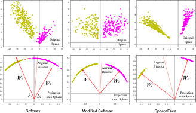

# Angular Loss 
## Angular loss (feat. Sphere face)

Center Loss의 문제점은 초기 Center 결정에 크게 예민하다는 문제점이 있습니다. 또한 초기 클래스 중심점 위치에 알고리즘이 크게 예민해지게 됩니다. 애초에 클러스터 중심점이 균일하지 못하게 분포하면 학습 역시 불균형하게 이루어집니다. 예를 들어서 초기 클러스터 중심점이 영점에 가깝게 형성되면 데이터 센터 간 분별이 어렵습니다.

Angular Loss 는 Center Loss 가 가지고 있는 데이터 중심점 의존성을 해결하기 위해 제안되었습니다. Angular Loss 부터는 데이터의 임베딩을 Cartesian 공간이 아닌 Hyperspere 에서 다룹니다. 그리고 클러스터의 중심점을 거리가 아닌 각도로 정의합니다. 

Hypersphere 상에서 각도 개념을 적용하기 위해 기존의 projection layer 에서 bias를 0으로 설정합니다. 또한 weight matrix 의 크기를 1로 두어 회전 변화의 성질을 가질 수 있도록 합니다. Cartesian Space 에서는 softmax probability 가 projection vector의 크기로 결정되지만 **Hypersphere 상에서는 클러스터 중심과의 각도**로 정의됩니다. 

$$
\mathcal{L}_{\text{mod. softmax}} = -\frac{1}{N} \sum_{i=1}^N \log \frac{\exp\{\mathbf{W}_{y_i}^T z_i + b_{y_i}\}}{\sum_{j=1}^m \exp\{\mathbf{W}_j^T z_i + b_j\}} \\
= -\frac{1}{N} \sum_{i=1}^N \log \frac{\exp\{\|\mathbf{W}_{y_i}\|\|z_i\|\cos(\theta_{y_i,i}) + b_{y_i}\}}{\sum_{j=1}^m \exp\{\|z_i\|\cos(\theta_{j,i}) + b_j\}} \\
= -\frac{1}{N} \sum_{i=1}^N \log \frac{\exp\{\|z_i\|\cos(\theta_{y_i,i})\}}{\sum_{j=1}^m \exp\{\|z_i\|\cos(\theta_{j,i})\}}
$$

식이 복잡하지만, 이야기했듯 Cross Entropy Loss의 Angular 버전이라고 이해하면 됩니다. data를 $i$ 클래스로 분류되기 위해서는 $\cos(\theta_i) > \cos(\theta_j)$ for all $j=1, ..., m(j\neq i)$ 조건을 만족해야 합니다.

추가적으로 Sphere Face 저자들은 HyperSphere 공간 상에서 각 Class들이 어느정도의 떨어진 거리를 가지고 연결될 수 있도록 **margin 개념**을 도입합니다. Metric Learning의 기본 개념들과 상당히 유사한 면이 있죠? Angular Loss에서 margin은, 어떤 클래스로 분류되기 위해서 다른 모든 클래스 중심과 떨어져야 하는 각도의 하한선과 같은 효과를 보여줍니다. 

cosine 함수는 $[0, \pi]$ 구간에서 단조 감소 함수이기 때문에 $\theta_i$ 값이 $[0, \frac{\pi}{\mu}]$ 구간에서 정의된다면 $\cos(\theta_j) > \cos(\mu \theta_j)$를 만족합니다. 기본 분류 조건에서 Margin 적용된 보다 엄격한 분류 체계를 다음과 같이 정의할 수 있습니다. $\cos(\mu \theta_i) > \cos(\theta_j)$ for all $j=1, ..., m(j\neq i)$, $\mu > 1$. 

마지막으로 Deep Learning 모델의 output으로부터 $\theta$ 의 범위를 엄격하게 제한하기 어렵기 떄문에 실수 범위의 값을 $[0, \pi / \mu]$ 범위로 mapping하기 위해서 $\psi(\theta) = (-1)^k \cos(\mu \theta) - 2k$ where $k \in [0, \mu-1]$ 함수를 사용할 수 있습니다.

