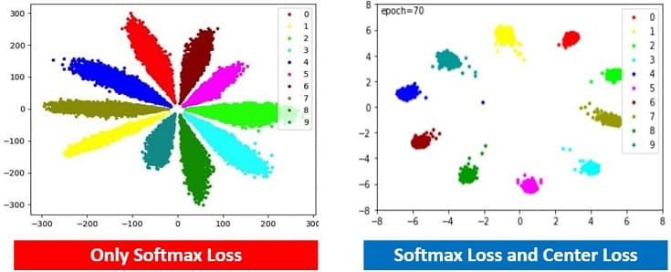

# Center Loss

Face Recognition 연구 초기에는 Metric Learning보다 Cross Entropy Loss를 활용한 Classification 학습이 대세였습니다. 근본이 있고 매우 강력한 Cross Entropy Loss이지만 Face Recognition 과제에서는 한가지 문제가 있었습니다. embedding space에서 class가 다른 feature들이 충분히 떨어져 있지 않다는 점입니다.

위 그림은 Cross-entropy를 통해 학습한 모델의 output 분포입니다. 서로 다른 class의 **data point들이 잘 나누어져 있지만 data cloud는 잘 나누어져 있지 않습니다**. 예를 들어서, 왼쪽 그림의 A point와 B point는 같은 class이지만 다른 class인 B point와 C point가 더 가깝습니다.

Cross-Entropy loss는 일단 **data point가 정확한 class로 구별되기만 하면 loss가 0이므로 더 이상 학습**되지 않습니다. 이로 인해 영점에 가까운 데이터들에 대해서 모델은 낮은 분별력을 보여주게 됩니다. 오른쪽의 test data point 분포를 보면, class간 구별이 거의 되지 않는 것을 확인할 수 있습니다.

:::note
Cross-Etnropy loss는 데이터가 나누어지기만 하면, 거리가 아무리 가까워도 신경쓰지 않습니다.
:::

**Center Loss**는 이를 해결하기 위해 같은 class에 속하는 데이터끼리는 더 가깝게 뭉치도록 하는 Regularization Term(**intra-class loss**) 을 Cross-Entropy loss와 함께 사용합니다. $c_{y_i}$ 는 class $y_i$의 center 입니다. 

$$
\mathcal{L}_{\text{center}} = \mathcal{L}_{\text{softmax}} + \frac{\lambda}{2} \sum_{i=1}^{N} \left\lVert f_\theta (x_i) - c_{y_i} \right\rVert_2^2
$$

Center Loss의 Regularization Term에 대한 직관적인 이해는: 중심에서 벗어나있던 datapoint들이 중심점으로 뭉치게 되고 더 잘 나누어지게 됩니다. 이 관점에서 $\lambda$ 값이 클수록 모델은 클래스 간 데이터를 나누는 것보다, 클래스 내의 데이터가 뭉치게 하는 것에 집중하게 됩니다. 실제로 나누어진 데이터를 살펴보면, Center Loss의 효과를 더 확실히 이해할 수 있습니다.

center loss에서 사용하는 class center는 Moving average입니다. 어떤 데이터가 어떤 클래스에 속한다고 판단할떄마다 class center는 변하게 됩니다. 
