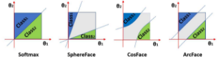

# Face Loss's
## CosFace & ArcFace Loss

## CosFace Loss

Sphere Face 함수는 $\mu$ 값을 통해서 margin을 조정합니다. 이 과정에서 $\theta$ 값을 $[0, \pi / \mu]$ 로 설정하기 위해 복잡한 함수를 사용해야 했습니다. cos face loss는 이 부분이 angular loss 해석의 직관성을 떨어뜨린다고 생각했고 더 직관적인 margin을 적용합니다. 

아래 식과 같이 cos 값 자체에 margin을 주는 방식입니다.

$$
\mathcal{L}_{\text{CosFace}} = -\frac{1}{N} \sum_{i=1}^N \log \frac{\exp\{s(\cos(\theta_{y_i,i}) - m)\}}{\exp\{s(\cos(\theta_{y_i,i}) - m)\} + \sum_{j \neq y_i} \exp\{s \cos(\theta_{j,i})\}}
$$

cosface loss로 학습한 데이터의 분포에서 margin의 역할은 angularFace 의 데이터 분포보다 더 직관적입니다. 식에서 $s$는 scaling parameter이며 $m$은 margin parameter입니다. CosFace 논문에서는 $s$와 $m$ 값의 설정이 매우 중요하다고 합니다.

## ArcFace
CosFace 논문은 classification margin을 cos space에서 계산했습니다. arcface 논문은 margin을 angular space에서 직접 계산합니다. 식은 더 직관적이지만, 벡터와 벡터 사이의 margin을 angular space에서 주는 연산은 실제로는 구현하기 복잡합니다.

$$
\mathcal{L}_{\text{ArcFace}} = -\frac{1}{N} \sum_{i=1}^N \log \frac{\exp\{s \cos(\theta_{y_i,i} + m)\}}{\exp\{s \cos(\theta_{y_i,i} + m)\} + \sum_{j \neq y_i} \exp\{s \cos(\theta_{j,i})\}}
$$

Angular Loss는 대부분의 benchmark에서 Angular Metric Learning 방법 중 가장 좋은 성능을 보였습니다. CosFace와 마찬가지로 ArcFace에서도 $s$와 $m$의 값 설정이 중요합니다. $s, m$ 값의 설정에 대한 논문이 있어서 첨부합니다: [Adacos](https://openaccess.thecvf.com/content_CVPR_2019/papers/Zhang_AdaCos_Adaptively_Scaling_Cosine_Logits_for_Effectively_Learning_Deep_Face_CVPR_2019_paper.pdf).

아래 그림은 지금까지 소개한 loss 함수의 decision boundaries를 묘사하고 있습니다.

