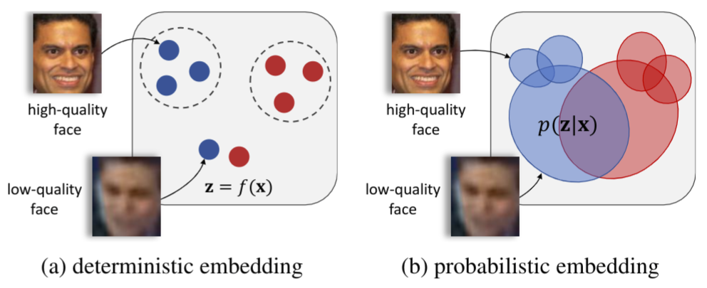

# Metric Learning on Cartesian

Deep Metric Learning 개념에 대해 읽기 앞서 [distance](/concepts/mlconcept/data/distance) 글과 [ML: metric learning](/concepts/mlconcept/taxonomy/metriclearning) 글을 참조하길 파악합니다.

Deep Learning 글에서는 Metric Learning 을 위해 발전되어온 Loss를 정리합니다.

## Notation

Contrastive Loss의 개념은 Metric Learning에서 사용하는 개념과 동일합니다. **distance** 함수로 초기의 metric learning frameworks들은 기본적으로 euclidean distance를 사용했습니다. 아래 그림은 n-차원 벡터간의 거리를 계산하는 Euclidean Distance 입니다.

$$
D(p, q) = \lVert p - q \rVert_2 = \left( \sum_{i=1}^{n} (p_i - q_i)^2 \right)^{\frac{1}{2}}
$$

Deep Metric Learning 은 $\theta$-parameterized model을 통해 표현되는 데이터의 임베딩, $f_{\theta} (x)$ 간의 거리 개념을 활용합니다. 이 글에서는 $D(f_\theta (x_1), f_\theta (x_2)) = D_{f_\theta}(x_1, x_2)$ 로 표현하겠습니다. 

## Contrastive Loss

Contrastive Loss의 목표는 Metric Learning의 기본적인 목표와 같습니다. **positive pair는 가깝게, negative pair는 멀게**

Machine Learning에서 Metric Learning은 data point들에 대한 spectral decomposition 등을 활용해서 이루어졌습니다. Deep Learning은 말 그대로 deep-nueral-network를 활용하기 때문에 모든 data point를 고려하는 방법론을 사용하기 어렵습니다. 초기의 Contrastive 형태는 매우 단순한 형태입니다.

$$
\mathcal{L}_{\text{contrast}} = \mathbb{I}_{y_1=y_2} D^2_{f_\theta}(x_1, x_2) + \mathbb{I}_{y_1 \neq y_2} \max(0, \alpha - D^2_{f_\theta}(x_1, x_2))
$$

**두 개의 datapoint를 비교해 positive라면 distance만큼 loss를 더하고 negative라면 distance만큼 loss를 감소시킵니다.** 즉, positive pair는 더 가까워지돌고 negative pair는 더 멀어지도록 학습하는 방식입니다. **Distance 기반 loss의 고질적인 문제점인 모든 거리가 0이 되어버리면 loss 역시 0이 되어버리므로 거리 margin $\alpha$ 를 활용**합니다. 

:::note
**Contrastive Loss에서 margin이란?**
negative sample 간의 최소 거리.
:::

당연히 이러한 방식은 한 번에 두개의 datapoint 만 고려하기 떄문에 large data 일수록 다양한 데이터 조합의 비교가 어렵습니다. 또한 한 번 데이터를 볼 때 positive 또는 negative 관계만 볼 수 있다는 점 역시 단점입니다. 마지막으로 학습 시간 역시 오래 걸리게 됩니다. 

## Triple Loss

Deep Learning 에서는 모델이 한 번에 하나의 데이터에서 얼마나 다양한 관점을 학습하는지가 매우 중요합니다. Contrastive Loss는 하나의 데이터에 대해 positive 또는 negative 관점의 정보만을 제공합니다.

Triplet Loss는 **하나의 data point에 대해 positive, negative 관점을 동시에 모델이 학습**하도록 합니다.

Triplet Loss 수식 역시 간단합니다. 단순히 Contrastive Loss에서 positive loss와 negative loss를 동시에 고려한 형태입니다.

$$
\mathcal{L}_{\text{triplet}} = \max \left( 0, D^2_{f_\theta}(x_a, x_p) - D^2_{f_\theta}(x_a, x_n) + \alpha \right)
$$

Triplet Loss 를 사용해서 모델을 학습시키는 과정에서 가장 어려운 점이 무엇일까요? loss의 구현과 같은 과정보다 더 어려운 것은 모든 data point에 대해 positive data와 negative data를 똑같은 숫자만큼 준비하는 것입니다. 이 시기부터 **negative mining**의 개념이 등장합니다.

### Negative Mining

negative mining이란, 주어진 데이터셑에서 어떤 datapoint 에 대한 negative pair를 찾는 작업입니다. 생각보다 어려운 작업입니다. 예를 들어서, 수많은 문서로부터 다른 사물을 분별하고 있는 문서를 찾아서 데이터를 준비하는 작업이 쉬울까요? 생각보다 어려운 작업이며, metric learning에서 가장 중요한 작업입니다.

negative mining 과정의 한 갈래로 hard negative mining이라는 개념도 있습니다. 이 개념은 **특히 어려운 negative pair**를 찾는 것에 집중합니다. `사과` 와 `배` 문서를 분별하는 것은 `사과`와 `컴퓨터` 문서를 분별하는 것보다 분명히 어려운 일일 것입니다. **hard negative pair는 분별하기 어려운 만큼 모델의 학습에서 매우 중요한 역할**을 합니다. 충분한 hard negative sample이 없다면 모델은 데이터 간의 대략적인 거리만을 익혀 easy negative sample만 구별할 수 있는 '멍청한' 모델이 되게 됩니다. 

## Quadraplet Loss

하나의 datapoint 에 대해 하나의 positive pair 그리고 두 개의 negative pair를 사용해서 학습합니다. 약간의 세부적인 인사이트가 더 있지만 중요하지 않다고 생각합니다.

## Small Batch 전부 보자, Structured Loss

Contrastive Loss ~ Quadraplet Loss 들은 한번에 2~4개 정도의 데이터 포인트를 학습합니다. 이 시기까지의 컴퓨팅 리소스의 한계, 그리고 deep metric learning 개념이 충분히 검증되지 않은 시기였기에 조심스러운 시도가 많았다고 생각합니다. Structured Loss 는 꽤 과감한 접근을 시도합니다.

Structure Loss는 한 step에서 모든 학습 데이터는 아니더라도, **small batch내의 모든 데이터를 고려한 loss를 제안**합니다. 사실 좋은 loss는 아니라고 생각하지만 small batch 내의 모든 데이터를 활용한다는 점에 그 의의가 있습니다. Strucute Loss 는 small batch 내에서 **positive 쌍 각각과 가장 가까운 두 negative data point가 최대한 멀어지도록** 학습합니다.

$$
\hat{J}_{i,j} = \max \left( \max_{(i,k) \in N} \left\{ \alpha - D^2_{f_\theta}(x_i, x_k) \right\}, \max_{(l,j) \in N} \left\{ \alpha - D^2_{f_\theta}(x_l, x_j) \right\} + D^2_{f_\theta}(x_i, x_j) \right)
$$

$$
\hat{\mathcal{L}}_{\text{structured}} = \frac{1}{2|P|} \sum_{(i,j) \in P} \max \left( 0, \hat{J}_{i,j} \right)^2
$$

**small batch를 전부 활용하는 loss**를 활용함으로써 기존과 비슷한 수준의 컴퓨팅 리소스를 활용하면서도 모델이 데이터를 보는 관점이 훨씬 풍부해졌고, 모델의 표현력 역시 크게 상승헀습니다. 이후의 Deep Metric Learning 은 **small batch 내의 모든 데이터를 활용하는 것은 당연**하고, 어떻게 더 잘 활용할지에 대해 고민하는 방향으로 발전합니다. 이 관점에서 magnet loss와 clustering loss가 등장하지만 이 두 loss는 크게 주목하지 못했습니다.

## 끝판왕, N-pair Loss

Metric Learning 에서는 개인적으로 끝판왕이라고 생각하는 N-pair loss 입니다. **InfoNCE loss**라는 이름으로도 유명하며 CLIP에서 적용한 loss로도 유명합니다. 

N-pair loss 는 Triplet Loss 의 Generalized Version으로 설명할 수 있습니다. N=3 인 tiplet loss, N=4인 Quadraplet loss의 연장선에서 N-pair loss는 하나의 positive pair와 N-1개의 Negative pair를 학습에 사용합니다. N-pair loss 논문에서 나온 loss는 다음과 같습니다.

$$
\begin{align*}
\mathcal{L}_{\text{pair}}(x, x^+, \{x_i^-\}_{i=1}^{N-1}) &= \log \left( 1 + \sum_{i=1}^{N-1} \exp(f(x)^\top f(x_i^-) - f(x)^\top f(x^+)) \right) \\
&= -\log \frac{\exp(f(x)^\top f(x^+))}{\exp(f(x)^\top f(x^+)) + \sum_{i=1}^{N-1} \exp(f(x)^\top f(x_i^-))}
\end{align*}
$$

식이 약간 복잡하지만 거리 함수로 feature 간의 내적을 사용했다는 점만 제외하면 그렇게 복잡하지 않습니다. triplet loss, quadraple loss와 마찬가지로 positive pair의 거리는 가깝게 negative pair의 거리는 멀게 하는 것이 목표입니다. 

:::note
사실 내적을 사용한다는 점에서 n-pair loss 는 이미 각도의 개념이 들어가있기 때문에 다음 포스트인 **metric learning on sphere**에 가깝다고 느낄 수 있을 것 같습니다. 어느정도 맞다고 생각하지만 n-pair loss의 접근법이 euclidean 기반의 triplet loss와 너무 근접하여 이 문서에 남겨둡니다.
:::

N-pair loss는 아무리 negative mining이 잘 되더라도 다양한 class가 존재하는 데이터에서 활용하는 것이 좋습니다. 최소 batch-size 정도의 class가 나누어져 있어야 n-pair loss의 의미가 극대화되기 때문입니다. 최근에는 N-pair loss를 사용해서 contrastive representation learning 등에 활용하고 있습니다.

# Ref
1. https://hav4ik.github.io/articles/deep-metric-learning-survey
2. https://papers.nips.cc/paper_files/paper/2016/file/6b180037abbebea991d8b1232f8a8ca9-Paper.pdf