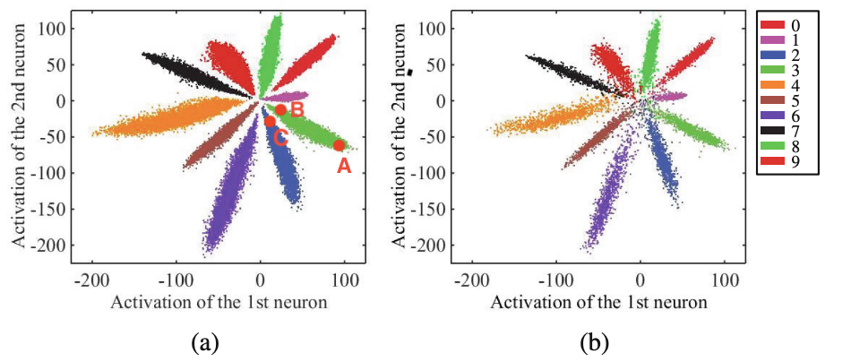
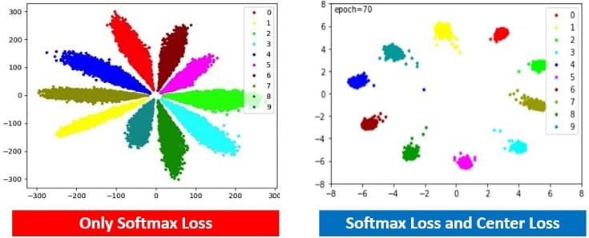
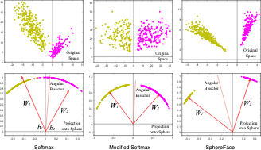
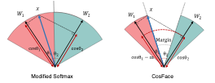
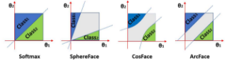

# Metric Learning on Sphere

Metrich Learning on Cartesian 에서 소개된 Loss들은 대부분 일반적인 data point 간의 distance에 집중합니다. 특히, eudclidean distance 위주로 발전해왔습니다. 이러한 접근 방법은 두 가지 한계를 가지고 있습니다.

- 적절한 거리 개념이 적용되었는지 확인하기 어렵다. 즉, "중간 정도 비슷한" 샘플 학습이 어렵다.
  - 이는 l2-distance 방법으로는 가능한 모든 공간에 negative data를 최대한 떨어뜨리는 방식으로 학습이 이루어지기 때문입니다.
- 그리고.. sampling 이 어렵다.
  - "적절한 거리" 라는 한계를 극복하기 위해 l2-distance 기반 방법에서는 "적절한 샘플링"을 통해 학습데이터를 구축하려 합니다.
  - 하지만 그냥 negative sampling 도 쉽지 않은데, "적절한" negative sampling이 쉬울리 없습니다.

초기 deep metric learning 은 **"거리 개념을 어떻게 학습할 수 있는가?"**  라는 질문에 **contrastive learning**을 해결책으로 제시했습니다. 그 후 다양한 관점을 학습하기 위해 **mini-batch 내 모든 data 를 활용할 수 있는 structured loss와 N-pair loss**가 등장합니다. 그리고 이 글에서는 deep metric learning의 다음 화두이자, 가장 중요한 주제인

**"완벽한 데이터 간의 거리를 어떻게 학습할까?"**

에 대해서 다룹니다.

:::note
첨언하자면, 저는 데이터 포인턱 간의 거리간 단순히 임베딩 포인터 간의 거리 함수로 표현되지 않을 것이라 생각합니다.
다만 임베딩은 가장 기본적인 형태이면서도 연구가 많이 이루어진 분야이니 임베딩 기반 인사이트를 따라가는 것이 분명 도움되는 부분이 있을 것 같습니다.
:::

Deep Metric Learning은 face recognition 을 연구하며 많이 발전했습니다. 이 글에서는 face recognition의 발전사를 따라가며 등장한 학습 방법과 loss를 다루겠습니다.

## Center Loss

Face Recognition 연구 초기에는 Metric Learning보다 Cross Entropy Loss를 활용한 Classification 학습이 대세였습니다. 근본이 있고 매우 강력한 Cross Entropy Loss이지만 Face Recognition 과제에서는 한가지 문제가 있었습니다. embedding space에서 class가 다른 feature들이 충분히 떨어져 있지 않다는 점입니다.

위 그림은 Cross-entropy를 통해 학습한 모델의 output 분포입니다. 서로 다른 class의 **data point들이 잘 나누어져 있지만 data cloud는 잘 나누어져 있지 않습니다**. 예를 들어서, 왼쪽 그림의 A point와 B point는 같은 class이지만 다른 class인 B point와 C point가 더 가깝습니다.

Cross-Entropy loss는 일단 **data point가 정확한 class로 구별되기만 하면 loss가 0이므로 더 이상 학습**되지 않습니다. 이로 인해 영점에 가까운 데이터들에 대해서 모델은 낮은 분별력을 보여주게 됩니다. 오른쪽의 test data point 분포를 보면, class간 구별이 거의 되지 않는 것을 확인할 수 있습니다.

:::note
Cross-Etnropy loss는 데이터가 나누어지기만 하면, 거리가 아무리 가까워도 신경쓰지 않습니다.
:::

**Center Loss**는 이를 해결하기 위해 같은 class에 속하는 데이터끼리는 더 가깝게 뭉치도록 하는 Regularization Term(**intra-class loss**) 을 Cross-Entropy loss와 함께 사용합니다. $c_{y_i}$ 는 class $y_i$의 center 입니다. 

$$
\mathcal{L}_{\text{center}} = \mathcal{L}_{\text{softmax}} + \frac{\lambda}{2} \sum_{i=1}^{N} \left\lVert f_\theta (x_i) - c_{y_i} \right\rVert_2^2
$$

Center Loss의 Regularization Term에 대한 직관적인 이해는: 중심에서 벗어나있던 datapoint들이 중심점으로 뭉치게 되고 더 잘 나누어지게 됩니다. 이 관점에서 $\lambda$ 값이 클수록 모델은 클래스 간 데이터를 나누는 것보다, 클래스 내의 데이터가 뭉치게 하는 것에 집중하게 됩니다. 실제로 나누어진 데이터를 살펴보면, Center Loss의 효과를 더 확실히 이해할 수 있습니다.

center loss에서 사용하는 class center는 Moving average입니다. 어떤 데이터가 어떤 클래스에 속한다고 판단할떄마다 class center는 변하게 됩니다. 

## Sphere Face & Angular Loss

Center Loss의 문제점은 초기 Center 결정에 크게 예민하다는 문제점이 있습니다. 또한 초기 클래스 중심점 위치에 알고리즘이 크게 예민해지게 됩니다. 애초에 클러스터 중심점이 균일하지 못하게 분포하면 학습 역시 불균형하게 이루어집니다. 예를 들어서 초기 클러스터 중심점이 영점에 가깝게 형성되면 데이터 센터 간 분별이 어렵습니다.

Angular Loss 는 Center Loss 가 가지고 있는 데이터 중심점 의존성을 해결하기 위해 제안되었습니다. Angular Loss 부터는 데이터의 임베딩을 Cartesian 공간이 아닌 Hyperspere 에서 다룹니다. 그리고 클러스터의 중심점을 거리가 아닌 각도로 정의합니다. 

Hypersphere 상에서 각도 개념을 적용하기 위해 기존의 projection layer 에서 bias를 0으로 설정합니다. 또한 weight matrix 의 크기를 1로 두어 회전 변화의 성질을 가질 수 있도록 합니다. Cartesian Space 에서는 softmax probability 가 projection vector의 크기로 결정되지만 **Hypersphere 상에서는 클러스터 중심과의 각도**로 정의됩니다. 

$$
\mathcal{L}_{\text{mod. softmax}} = -\frac{1}{N} \sum_{i=1}^N \log \frac{\exp\{\mathbf{W}_{y_i}^T z_i + b_{y_i}\}}{\sum_{j=1}^m \exp\{\mathbf{W}_j^T z_i + b_j\}} \\
= -\frac{1}{N} \sum_{i=1}^N \log \frac{\exp\{\|\mathbf{W}_{y_i}\|\|z_i\|\cos(\theta_{y_i,i}) + b_{y_i}\}}{\sum_{j=1}^m \exp\{\|z_i\|\cos(\theta_{j,i}) + b_j\}} \\
= -\frac{1}{N} \sum_{i=1}^N \log \frac{\exp\{\|z_i\|\cos(\theta_{y_i,i})\}}{\sum_{j=1}^m \exp\{\|z_i\|\cos(\theta_{j,i})\}}
$$

식이 복잡하지만, 이야기했듯 Cross Entropy Loss의 Angular 버전이라고 이해하면 됩니다. data를 $i$ 클래스로 분류되기 위해서는 $\cos(\theta_i) > \cos(\theta_j)$ for all $j=1, ..., m(j\neq i)$ 조건을 만족해야 합니다.

추가적으로 Sphere Face 저자들은 HyperSphere 공간 상에서 각 Class들이 어느정도의 떨어진 거리를 가지고 연결될 수 있도록 **margin 개념**을 도입합니다. Metric Learning의 기본 개념들과 상당히 유사한 면이 있죠? Angular Loss에서 margin은, 어떤 클래스로 분류되기 위해서 다른 모든 클래스 중심과 떨어져야 하는 각도의 하한선과 같은 효과를 보여줍니다. 

cosine 함수는 $[0, \pi]$ 구간에서 단조 감소 함수이기 때문에 $\theta_i$ 값이 $[0, \frac{\pi}{\mu}]$ 구간에서 정의된다면 $\cos(\theta_j) > \cos(\mu \theta_j)$를 만족합니다. 기본 분류 조건에서 Margin 적용된 보다 엄격한 분류 체계를 다음과 같이 정의할 수 있습니다. $\cos(\mu \theta_i) > \cos(\theta_j)$ for all $j=1, ..., m(j\neq i)$, $\mu > 1$. 

마지막으로 Deep Learning 모델의 output으로부터 $\theta$ 의 범위를 엄격하게 제한하기 어렵기 떄문에 실수 범위의 값을 $[0, \pi / \mu]$ 범위로 mapping하기 위해서 $\psi(\theta) = (-1)^k \cos(\mu \theta) - 2k$ where $k \in [0, \mu-1]$ 함수를 사용할 수 있습니다.

## CosFace Loss

Sphere Face 함수는 $\mu$ 값을 통해서 margin을 조정합니다. 이 과정에서 $\theta$ 값을 $[0, \pi / \mu]$ 로 설정하기 위해 복잡한 함수를 사용해야 했습니다. cos face loss는 이 부분이 angular loss 해석의 직관성을 떨어뜨린다고 생각했고 더 직관적인 margin을 적용합니다. 

아래 식과 같이 cos 값 자체에 margin을 주는 방식입니다.

$$
\mathcal{L}_{\text{CosFace}} = -\frac{1}{N} \sum_{i=1}^N \log \frac{\exp\{s(\cos(\theta_{y_i,i}) - m)\}}{\exp\{s(\cos(\theta_{y_i,i}) - m)\} + \sum_{j \neq y_i} \exp\{s \cos(\theta_{j,i})\}}
$$

cosface loss로 학습한 데이터의 분포에서 margin의 역할은 angularFace 의 데이터 분포보다 더 직관적입니다. 식에서 $s$는 scaling parameter이며 $m$은 margin parameter입니다. CosFace 논문에서는 $s$와 $m$ 값의 설정이 매우 중요하다고 합니다.

## ArcFase Loss

CosFace 논문은 classification margin을 cos space에서 계산했습니다. arcface 논문은 margin을 angular space에서 직접 계산합니다. 식은 더 직관적이지만, 벡터와 벡터 사이의 margin을 angular space에서 주는 연산은 실제로는 구현하기 복잡합니다.

$$
\mathcal{L}_{\text{ArcFace}} = -\frac{1}{N} \sum_{i=1}^N \log \frac{\exp\{s \cos(\theta_{y_i,i} + m)\}}{\exp\{s \cos(\theta_{y_i,i} + m)\} + \sum_{j \neq y_i} \exp\{s \cos(\theta_{j,i})\}}
$$

Angular Loss는 대부분의 benchmark에서 Angular Metric Learning 방법 중 가장 좋은 성능을 보였습니다. CosFace와 마찬가지로 ArcFace에서도 $s$와 $m$의 값 설정이 중요합니다. $s, m$ 값의 설정에 대한 논문이 있어서 첨부합니다: [Adacos](https://openaccess.thecvf.com/content_CVPR_2019/papers/Zhang_AdaCos_Adaptively_Scaling_Cosine_Logits_for_Effectively_Learning_Deep_Face_CVPR_2019_paper.pdf).

아래 그림은 지금까지 소개한 loss 함수의 decision boundaries를 묘사하고 있습니다.

# Conclusion

- data가 많이 없거나, Unsupervised Setting에서는 일반적으로 **Triplet Loss** 가 SOTA.
- Supervised setting 에서 data가 충분한 경우 **ArcFace** 가 SOTA

# Ref.

1. https://hav4ik.github.io/articles/deep-metric-learning-survey