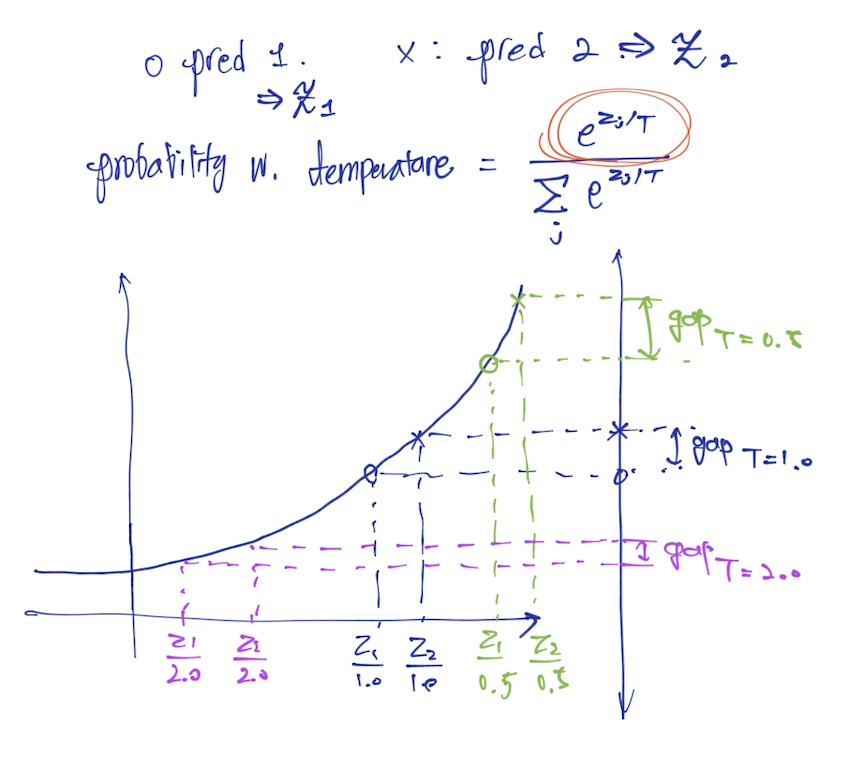

# Decoding Method

Generation Model 에서 텍스트를 생성하기 위해서는 **디코딩** 이라는 과정이 필요합니다.

현대의 Generation Model 은 Neural Network 를 기반으로 **어떤 토큰이 나타날 확률**을 구할 수 있습니다. 그리고 이 일련의 토큰 확률로부터 최종적인 텍스트를 생성해내는 과정을 **디코딩** 이라고 합니다.

예를 들어서 "먹었다" 라는 토큰이 앞에서 나왔다면 뒤의 토큰 확률 1위가 "책상" 이더라도 2위인 "사과"를 선택하는 게 더  현명할 것입니다. 이 글에서는 text를 생성하는 과정에서 토큰을 선택하는 5가지의 디코딩 전략을 

## Greedy Search

Greedy Search 방식은 현재까지 생성된 텍스트로부터 가장 확률이 높은 토큰을 다음 토큰으로 선택합니다.

$$
w_t = \underset{w}{\text{argmax}} \ P(w | w_{1:t-1})
$$

Greedy Search 알고리즘의 가장 큰 장점은 직관적이며 계산 비용이 매우 낮다는 점입니다.

Greedy Search 방식은 **두 가지 문제점**이 있습니다. 첫 번째로는 문장 생성 과정에서 현재 시점에서의 best 전략만 선택하다보니 **미래 시점에서 더 좋은 토큰 배열을 확인할 수 없다**는 점입니다. 예를 들어서 그림에서는 "The nice woman" 문장의 확률보다 "The dog has" 의 확률이 최종적으로 높지만 Greedy Search 방식으로는 이 문장을 생성할 수 없습니다.

두 번째 문제점은 Greedy Search 방식에서는 동어 반복이 특히 자주 발생한다는 점입니다.

## Beam Search

Beam Search는 각 시점에서 가장 확률이 높은 토큰만을 선택하지 않고 N개 까지의 선택지를 같이 살펴봅니다. 이 전략을 그림으로 표현하면 아래와 같이 여러개의 붉은 색 선으로 이루어진 "가지(prune)" 을 보게되는데 Beam Search 방식에서는 이 가지들을 **Beam** 이라고 합니다.

Beam Search 의 장점은 현재 시점에서 알 수 없는 더 높은 확률의 토큰 배열까지 찾아낼 수 있다는 점입니다. 

하지만 Beam Search 는 n이 커짐에 따라 계산량이 증가한다는 단점이 있습니다. 실제로 생성하는 텍스트가 길어질수록 이 부분은 꽤 큰 부담으로 다가오게 됩니다.

그리고 역시 Greedy Search 와 마찬가지로 동어 반복 문제가 꽤 자주 발생합니다.

## Sampling

## Top-k Sampling

## Top-p Sampling