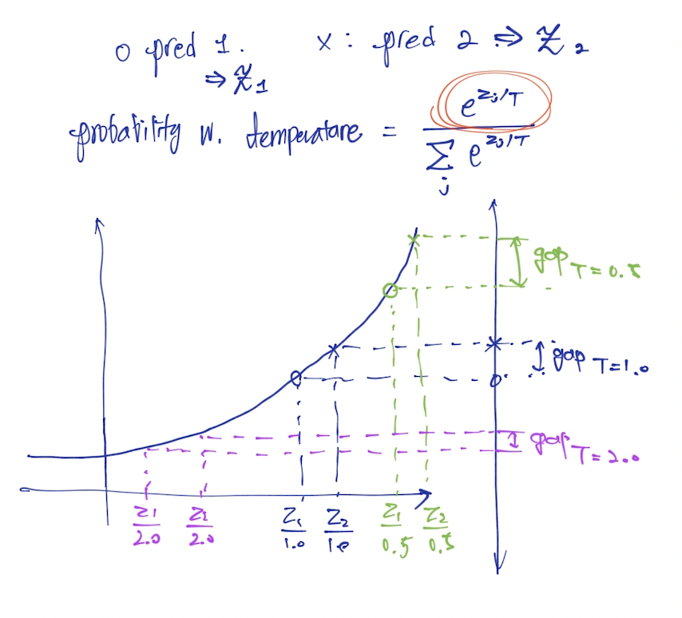

# Temperature 개념의 직관적 이해

LLM 에서 Temperature 를 이야기하면 대부분 이정도로만 이해한다.

"Temperature 가 높아질수록 답변이 창의적이나 엉뚱해지고, Temperature 가 낮을수록 답변이 딱딱하지만 정확해진다."

조금 더 깊게 이해한 사람들은 아래와 같이 이해하고 있을 것이다.

"Temperature 가 높아질수록 next token 확률이 균등해지고, temperature 가 낮을수록 확률이 편향이 심해진다."

softmax 함수와도 연관하겠지만, 이를 한번 더 생각하거나 계산해보지 않고 머릿속에 그림처럼 남겨보자.

## Temperature 함수의 기본 이해.

llm 에서 sequence decoding 은 기본적으로 토큰 확률에 비례한 샘플링 방식을 사용한다.

이 때, 토큰 확률은 잘 알려진 softmax 함수를 주로 사용한다.

$$$
\mathrm{softmax}(z_i) = \frac{e^{z_i}}{\sum_{j=1}^{K} e^{z_j}}
$$$

temperature 함수는 softmax 함수의 input 값인 모델 activation 값에 적용된다. 

$$$
\mathrm{softmax}(z_i; T) = \frac{e^{z_i / T}}{\sum_{j=1}^{K} e^{z_j / T}}
$$$

이렇게 T 를 적용한 결과가 왜 서론에서 써둔것처럼 동작하는 것일까?

## Temperature 함수의 그래프 해석

엄밀한 그래프가 오히려 해석하기 어려우니, exponential 그래프 상에서 $T$ 값에 따른 간격의 변화를 살펴보자.

그림에서 볼 수 있듯이 pred0 와 pred1 의 y축 상의 확률 차이는 T 값이 커질수록 작아지고 T 값이 작을수록 커지게 된다.

:::tip
즉, T 값이 커질수록 sequence decoding 과정에서 모델은 token 들을 헷갈려하지만: 모델 출력에 의한 확률 차이가 줄어듬.

T 값이 작아질수록 모델은 token 을 덜 헷갈려한다: 모델 출력에 의한 확률 차이가 커짐.
:::

여기에 T 값에 의한 x축 상의 변화를 살펴보는 것도 재밌을 것이다. 어렵지 않으니 읽어보면서 간단하게 생각해보시길.