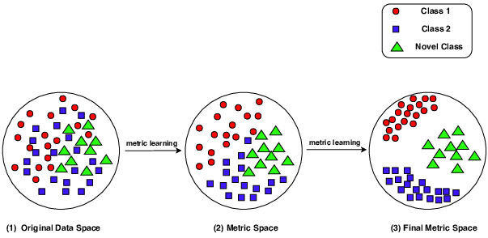

# Metric Learning

Dimensionality reduction 와 manifold learning 의 한 종류로써,

metric learning 은 **서로 다른 데이터를 떨어뜨리고, 비슷한 데이터를 가까이**하는 distance metric 또는 embedding space 를 학습하는 방법입니다.

아래 순서로 metric learning 개념들을 정리합니다.

- Distance
- Spectral metric learning
  - generalized eigenvalue problem 의 한 형태로, matrix 분해를 통해 좋은 projection 을 찾는 방식.
- Probabilistic metric learning
  - probability distribution 을 통해 좋은 projection 을 찾는 방법
- Deep metric learning
  - deep neural network 의 활용

