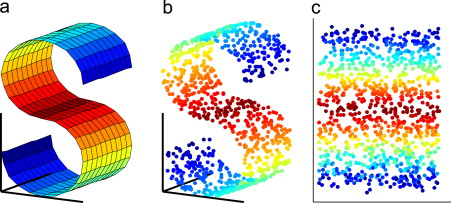

# Curse of Dimension

 데이터 분석에서 데이터의 차원이 커지면서 발생하게 되는 문제들의 총칭.

 현대 인공 지능 과제의 input 인 image, text, audio 등의 데이터는 매우 고차원 데이터이다. 예를 들어서, 250 x 250 RGB 이미지의 경우 **187,500 차원**의 데이터이다!

 한 마디로 현대 인공 지능 과제를 수행할 때는 필수적으로 동반되는 문제.

## Sparsity

 데이터 공간의 크기는 데이터 차원에 대해 exponential 하므로, 데이터의 차원이 커질수록 데이터는 공간 상에서 매우 sparse 해진다.

 - 데이터의 분석이 어려워진다.
 - 분석을 위해 필요한 데이터의 수 역시 기하급수적으로 증가한다.

## Space & Computation complexity

데이터 저장 & 처리를 위한 메모리 공간, 시간 상의 복잡도가 매우 커진다.

## High degrees of freedom.

 차원이 높은 만큼 자유도가 높아지고, 이로 인해 noise 에 매우 취약해진다. sparse data + noise sensitive 해서 **overfitting** 에도 매우 취약해진다.

## Visualization

 고차원의 데이터는 시각화하기 어려우며, 이는 직접적인 데이터 분석의 어려움을 가져온다.

# Dimension Reduction

고차원의 데이터는 curse of dimension 으로 인해 다루는 게 매우 어려워서, 머신 러닝에서는 고차원의 데이터에서 우리가 필요로 하는 특성을 전부 잘 나타낼 수 있는 저차원의 공간이 있다고 가정합니다. 그리고 이러한 저차원의 공간을 **manifold** 라고 부르며 **manifold**를 찾는 학습 방법을 **manifold learning** 이라고 합니다.

 

그리고 이와 비슷하게 고차원의 데이터의 저차원 표현을 배우는 학습을 **representation learning** 이라고 합니다.
 