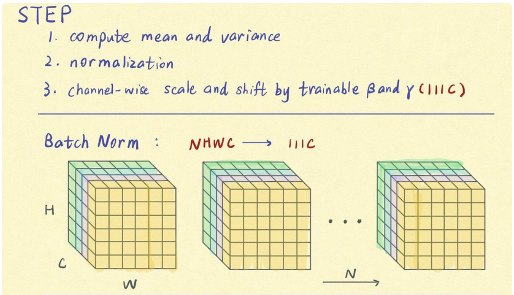

# Normalization

Normalization 의 의의를 정확하게 이해하기 위해서는 Stochastic Gradient Descent 와 같은 통계적 기법에 대한 이해가 필요합니다. 딥 러닝을 하는 최선의 방법은 모든 데이터 샘플을 한 번에 학습하는 방법입니다. 다만 실제로 연산을 수행하는 하드웨어의 리소스 한계로 그런 방법은 거의 불가능합니다. 그렇기에 현대의 딥러닝에서 일반적으로 사용하는 방법은 전체 데이터 샘플을 훨씬 작은 단위로 나누어서 처리하는, mini-batch 에 기반한 방법론입니다.

mini-batch 기반 방법론을 적절하게 사용하려면 각각의 mini-batch 가 전체 데이터 샘플의 특성에서 크게 벗어나지 않는 것이 중요해집니다. 하지만 모든 mini-batch 를 전체 데이터 특성을 고려해서 구성하는 것은 매우 어려운 작업입니다. 이런 경우 사용할 수 있는 통계적 도구는, 모든 mini-batch 의 통계적 특성을 비슷하게 통일하는 - **정규화** - 입니다.

전체 데이터와 각각 mini-batch 의 통계적 특성을 비슷하게 유지하므로 전체적으로 모델의 학습이 더욱 안정적으로 진행되는 효과를 가져오게 됩니다.

- 수렴 속도 개선
- 모델 성능 향상
- gradient vanish / explode 개선

## Batch Normalization (2015)

> Distribution of Non-linearity inputs remains more stable as the network trains, then the optimizer would be less likely to get stuck in the saturated regime, and the training would accelerate

### Internal Covariate Shift

초기 Batch Normalization 은 Internal Covariate Shift 문제를 해결하기 위해 제안되었습니다.

Internal Covariate Shift 는 딥러닝 모델의 각 레이어 입력의 분포가 매 스텝 달라지는 현상입니다. 특히 딥러닝 모델의 특성상 초기 레이어의 값이 큰 영향을 미칩니다. 나비효과와 비슷하죠. 

레이어의 입력 분포가 매 스텝 달라지는 것은 모델이 매번 전혀 다른 데이터를 보는 것과 비슷하고, 이로 인해 깊은 모델이 될 수록 학습이 어려워진다고 여겨졌습니다. Batch Normalization 은 이런 환경에서 각 레이어의 입력 분포가 크게 튀지 않도록 하기 위해 등장했습니다.

다만, 최근의 연구는 **Batch Normalization 은 실질적인 효과는 Internal Covariate Shift 를 줄이는 것보다는 전체적인 학습이 안정화하는 것**이라고 이야기합니다. 사실 모델의 크기가 커진다면, 각 레이어의 입력 분포가 달라지는 것은 문제가 아닙니다. 입력 분포에 따른 결과 분포의 정합성만 확실하면 괜찮습니다. 

### Batch Normalization

Batch Normalization 은 **각 채널에 대해서 전체 배치의 평균, 분산으로 Normalization**을 수행합니다.

- 채널이란, 각 데이터를 표현하는 독립적 element 입니다.
  - 색으로 치면 RGB 가 각각의 채널이며,
  - python list 에서는 각각의 element 의 인덱스가 channel 이라고 볼 수 있습니다.

Batch Normalization 의 큰 장점은 

- 학습 속도 향상
- 초기값 영향 감소
- 학습 안정화

입니다. Batch Normazliation 은 오래된 방법이지만 가장 최근 모델에서도 꾸준히 사용되고 비교되는 강력한 Normalization 기법입니다.

## Weight Normalization (2016)

Batch Normalization 다음에 나온 논문. 이름에서도 유추되지만 일반적인 Normalization 기법과 개념이 다릅니다. 