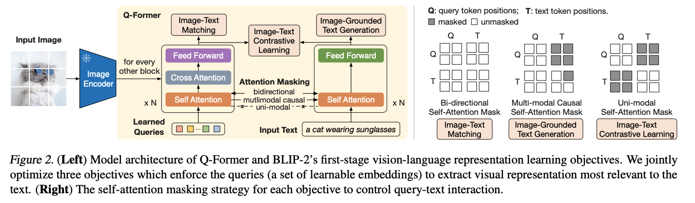

# ALBEF
## Align Before Fuse: Vision and Language Representation Learning with Momentum Distillation

## Motivation

ALBEF model 의 목적은 크게 두 가지 입니다. CLIP 과 관련된 글들에서 소개할 모델들 대부분의 목적이기도 한데요.

1. text, image 각각에 대한 unimodal encoder.
2. text-image 가 전부 고려된 multimodal encoder.

다만 ALBEF 이전에는 두 task 를 따로따로 고려해 왔습니다. 이전의 multimodal encoder 는 **object detector 에서 추출한 image feature 를 word token 과 fusion 하는 방식**으로 이루어졌습니다. 

해당 방식은 매우 높은 품질의 데이터셑을 요구합니다. 그러나 대부분의 pretrain용 데이터셑은 noisy가 많은 대신 양이 많은 규격을 취하고 있습니다. 그러므로 기존 방식으로는 multimodal backbone encoder를 위한 유의미한 pretrain을 수행하기 어렵습니다.

또한, 기존 multimodal train 방식은 **text feature와 image feature가 같은 embedding space에서 분포하고 있지 않은 상태로 fusion을 수행**합니다. 예를 들어서, "기차" 라는 텍스트와 기차의 이미지가 서로 멀리 위치하고 있다는 말입니다. 특히, cross-attention 등을 사용하는 모델에서는 이 차이가 더욱 크게 부각됩니다. 모델이 쉽게 각 modality간의 연관성을 파악하지 못합니다.

CLIP과 ALIGN과 같은 논문은 반면 각각의 unimodal encoder 를 잘 학습시키고 있습니다. 특히 이들의 학습 방식은 대량의 noisy dataset에 대해서 텍스트와 이미지의 representation 을 서로 가깝게 하는 **image-to-text, text-to-image contrastive loss를 사용했기 때문에 이미지와 텍스트의 임베딩이 어느정도 alignment 가 이루어져있을** 것을 기대할 수 있습니다.

ALBEF 논문은 이 점에서 착안해서 기존 multimodal pretrain 방식의 문제점을 두 가지 다 해결합니다.

대량의 데이터셑에 대해서 multi-modal contrastive loss 를 활용해서 alignment 를 수행하고 fusion을 통해 multimodal representation을 학습하는 방식입니다.

## Data

 ALBEF 논문은 두 개의 web dataset(Conceptual Captions, SBU Captions)와 두 개의 in-domain datasets(COCO, Visual Genome) 을 사용합니다. 총 이미지의 수는 14.1M 개입니다. web dataset 의 경우 in-domain dataset 에 비해 noise가 많은 데이터입니다.

## Model

### Train
ALBEF 논문의 Motivation 을 이해했다면 모델 구조를 이해하기 어렵지 않습니다. ALBEF 의 구조는 **fusion 이전의 image-text contrastive loss를 통한 alignment**와 alignment 이후 **fusion을 통한 multimodal representation 학습**으로 나누어집니다.

먼저 Alignment 단계인 Image-Text Contrastive learning을 먼저 살펴보겠습니다. 이 논문의 특징은 모든 loss 를 정보이론적 관점에서 유도하는 식으로 명시한다는 점입니다.

$$
L_{itc} = \frac{1}{2} E_{(I,T) \sim D}[H(y^{i2t}(I), p^{i2t}(I)) + H(y^{t2i}(T), p^{t2i}(T))]
$$

이 식은 실제 image와 text가 pair 일 확률과 모델이 예측한 분포의 cross-entropy를 표현합니다. 즉, CLIP 에서 사용한 loss 식과 동일합니다.

**alignment 이후 fusion**은 두 가지 loss 로부터 학습됩니다. **Masked Language Model**과 **Image-Text Matching**입니다. 이 단계에서 모든 task는 text 또는 image unimodal 이 아닌 text+image multimodal embedding을 기반으로 수행됩니다. 두 가지의 task에 대한 loss가 모델 학습에 사용됩니다.

첫 번째는 masked languge modeling입니다. language model 공부하면서 익히 보셨을 그 MLM과 동일한 의미입니다.
$$
L_{mlm} = E_{(I, \hat{T}) \sim D} H(y^{mask}, p^{mask}(I, \hat{T}))
$$

두 번째는 Image-Text Matching 으로 multimodal embedding을 기반으로 각각의 이미지, 텍스트가 서로 연관이 되어 이쓴ㄴ지 확인하는 과제입니다. Image-Text Matching 이 이전 단계인 ITC 에서 아무리 잘 수행됐더라도 multimodal embedding을 잘 생성하지 못하면 지표가 좋게 나올 수 없다는 말입니다. 각 task의 loss 는 역시 정보이론적인 관점에서 기술됩니다.

$$
L_{itm} = E_{(I, T) \sim D} H(y^{itm}, p^{itm}(I, T))
$$

최종적인 loss 는 세 값을 전부 더한 값입니다. 즉 ALBEF 모델은 Alignment를 먼저 학습하지 않습니다. batch를 (image, text) pair 를 배치로 사용하고 이로부터 모델을 학습해나갑니다.

$$
L = L_{itc} + L_{mlm} + L{itm}
$$

### Moemntum Distillation

CLIP 을 비롯한 모델들의 학습 방법에는 한 가지 문제점이 있습니다. Noisy dataset 을 사용한 이유도 있지만 그보다 근본적으로 존재하는 문제입니다. 이미지에 대한 텍스트 설명이 한 가지가 아닐 수 있다. 그리고 텍스트에 상응하는 이미지가 하나가 일 수 있다는 점입니다. binary label 로 학습을 진행하는 MLM 에는 충분한 정제가 이루어지지 않으면 치명적인 부분입니다.

논문에서는 $L_{itc}^{mod}$를 계산합니다. 각각의 loss 에 대해서는 momentum distillation은 기존 로직으로 발생한 loss만큼 신규 로직에 대한 weight를 감소싴ㅂ니다.

## Analysis

이 논문의 정수는 두가지가 있습니다.

첫 번째는 기존의 unimodal train framework 와 multimodal train framework 를 통합시켰다는 점입니다. 다만, 이 과정에서 alignment에 대한 논의는 이전 논문 그리고 후속 논문에서 꾸준히 연구되어집니다. 저도 한 번 CLIP-계열 모델의 alignment에 대한 주제로 글을 써볼 생각입니다.

두 번재는 현상에 대한 정보이론 관점의 분석입니다. 이 논문에서 물론 모든 loss에 닿는 분석을 순차적으로 진행하지는 않지만 예측 분포 $q$와 실제 분포 $p$ 사이의 거리 분포에 대한 항을 전부 더해줍니다. KL divergence와 cross entropy가 혼재하는, 엄청 해석하다보면 아름다운 식인데요... 

이 글에서는 못 남기는게 아쉬울 따름입니다. 언젠가 이 글도 보충해두겠습니다. 다만 별 어려운 건 없습니다. 저자들은 alignment, 즉 tex representation 과 image representation 이 서로 align되길 바라는 점에서 비슷한 점이 있거든요.

제가 글을 쓰는 이유 중 하나는, motivation의 정리입니다. 사실 motivation만 잘 이해한다면 어떤 논문을 읽더라도 저자의 의도를 잘 이해하고 해석할 수 있을 거라 믿습니다. 정리글을 보더라두요. 감사합니다.

## Result

# Ref
1. [Align before Fuse: Vision and Language Representation Learning with Momentum Distillation](https://arxiv.org/pdf/2107.07651.pdf)

