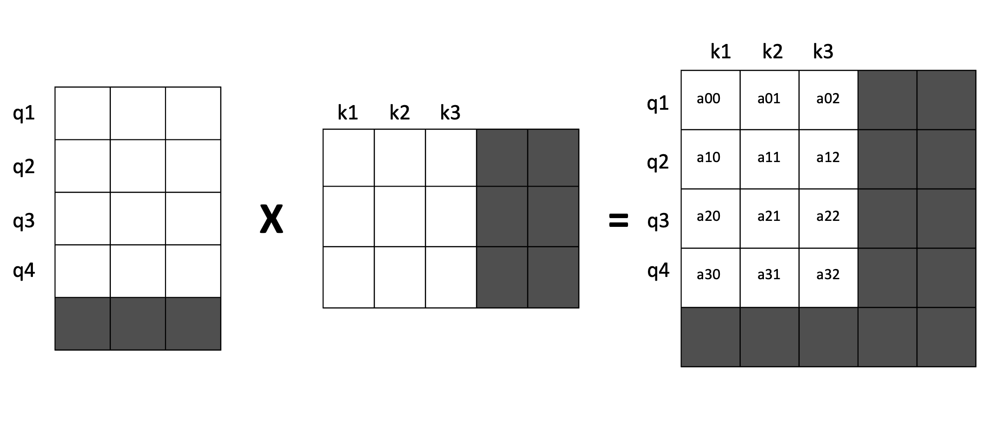
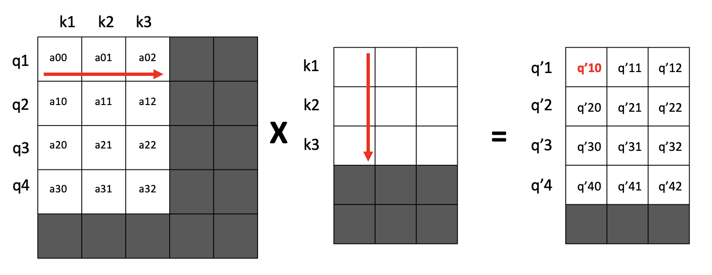

# Cross Attention

`Attention is All you Need` 논문에서 소개한 Cross-attention 개념에 대해서 조금 더 다루겠습니다. Self-attention 과도 같은 개념이지만 Cross Attention이 조금 더 헷갈릴 수 있어서 Cross Attention 개념으로 정리하겠습니다.

## Weighted Sum of Tensor

먼저 벡터(텐서)의 Weighted Sum 개념을 당연히 알겠지만 한 번만 더 짚고 넘어가겠습니다.

$$
\mathbf{y} = w_0 \mathbf{x}^0 + w_1 \mathbf{x}^1 + \dots + w_n \mathbf{x}^n
$$

이러한 weighted sum에서 vector $y$의 각 element의 표현형은 아래와 같습니다.

$$
y_i = w_0 x^0_i + w_1 x^1_i + \dots + w_n x^n_i
$$

즉, vector $y$의 $i$th element 는 성분 벡터 $x_k$ 들의 $i$th element의 weighted sum 으로 표현됩니다. 

## Attention Score

$$
\text{Attention}(Q, K, V) = \text{softmax}\left(\frac{QK^T}{\sqrt{d_k}}\right) V
$$

Attention 함수에서 다른 부분은 신경쓰지 않고 먼저 $QK^T$ 부분을 살펴보겠습니다. 이 부분에 대한 글을 인터넷에서도 많이 찾아볼 수 있어서 간단하게 설명하겠습니다.

$QK^T$의 연산결과는 **attention score matrix** 입니다. **Attention Score Matrx**의 $(i,j)$ 성분은 $i$ 번쨰 쿼리 토큰의 임베딩과 $j$ 번째 키 토큰의 임베딩의 내적, 즉 일종의 similarity 개념으로 이해할 수 있습니다.

## Cross Attention

Cross Attention은 일반적으로 인코더 임베딩을 쿼리로, 디코더 임베딩을 키와 밸류로 사용합니다. value = key 이므로 cross attention을 그림으로 표현하면 아래와 같습니다. 

Cross Attention의 $(QK^T)V$ 연산을 통해 생성되는 $(i,j)$ 성분은 다음과 같은 수식을 가지고 있습니다. 

$$
q'_{i,j} = \sum_{l=0}^{K} a_{il} k_{lj}
$$

$a_{il}$은 query $i$와 key $j$의 연관성을 의미합니다. 그리고 $k_{lj}$ 는 key $l$의 $j$ 번째 성분입니다.

즉 cross attention 은 query와 key의 연관도를 weight로 사용해서, value의 element로 query embedding을 재구성하는 과정입니다. weighted vector 연산과 다른 점은 각 벡터 요소마다 weight 가 다르게 적용된다는 점입니다. attention 값으로요. 