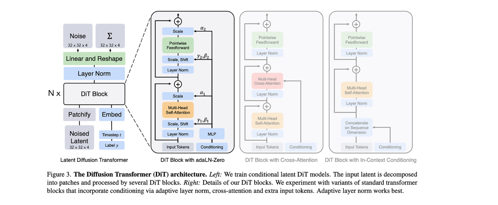

# Diffusion Transformer

diffusion model input

latent -> input image VAE 통과시킨 평균값. 분산값은 사용안함. 당연히, 노이즈가 포함되어 있다고 본다.

timestep -> 현재 스텝. 초기에는 강한 이미지 제거. 이미지의 큰 피쳐 확인. 후반에는 이미지의 상세 피쳐 확인하는 식이 됨.

label -> 복원하고자 하는 이미지의 클래스. 텍스트 프롬프트를 사용하기도 함. Stable Diffusion 방식.

- Output

- 엡실론 : 예측 노이즈와 분산. input 잠재 벡터에서 노이즈를 빼는 방식으로 다음 이미지 latent value 를 가져오게 됨.

- 시그마 : 매 단계마다 약간의 새로운 노이즈를 추가하는 과정이 DiT 에 있음. 새로운 무작위 노이즈의 강도임. 다양한 이미지 생성을 위해서임. 초기 타임스텝에서는 거의 독립적이고 큰 변화를 주는 노이즈가 등장함. 이미지의 각 요소가 독립적으로 변하고, 후기 타임 스텝에서는 공분산이 있게 등장함. 예를 들어서, 눈과 눈썹의 형태가 함께 변하도록 시그마가 생성됨. 참고로, DDPM 에서는 이 값이 hyperparameter 에 의해 스케쥴링 되는 값이었음.