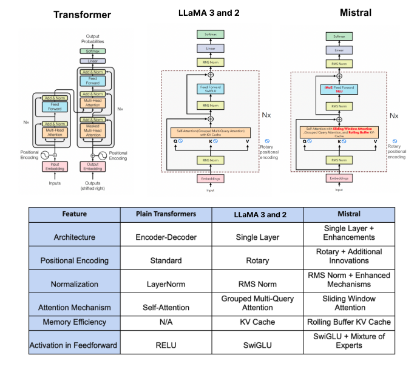

# Llama

## Architecture

Llama의 구조는 single layer를 사용하는 decoder-only 구조를 취한다. 기존 transformer의 encoder-decoder 구조에서는 decoder 가 self-attention / cross-attention 을 가지고 있지만 Llama 구조에서는 decoder 가 single-attention 만 가지고 있다. 

Llama 에서 채용한 추가적인 구조상 특징은 다음과 같다.

- Pre-Normalization [GPT-3]
  - normalize the input of each transformer sub-layer, instead of normalizing output
  - **훈련 안정성 증가**
- SwiGLU activation [PaLM]
  - RELU -> SwiGLU
- Rotary Embedding [GPTNeo]
  - absolute positional embedding 대신 rotary positional embedding 사용.
  - input_length 가 길어질수록 의미 있어 보임.

## Efficient Implementation

- Attention 을 효율적으로 구현하는데 리소스를 많이 소모.
  - storing the attention weights and not computing the key/query scores.
  - reduce the amount of activations that are recomputed during backward through checkpointing
  - save activations that are too expensive
- manually import backward functioin

## Main Result

LLM Model 이 기존 LM 과 대비하여 보여주는 큰 차이점은 Instruction을 제공했을 때의 zero-shot 성능입니다. 두 번째로는 매우 적은 데이터로 수행 가능한 Instruction Tuning 성능입니다. Llama 모델은 두 과제 전부에 대해서 좋은 성능을 보여줬습니다. 이 글을 쓰는 시점에서 Llama 모델이 보여준 Zero-shot 성능과 Instruction Tuning 성능을 나열하는 것은 큰 의미가 없다고 생각합니다.ㅏ

# Scaling

Llama 논문에서 가장 재미있던 부분은 Scalining 에 관한 부분입니다. 따로 정리를 조금씩 해두려고 합니다.