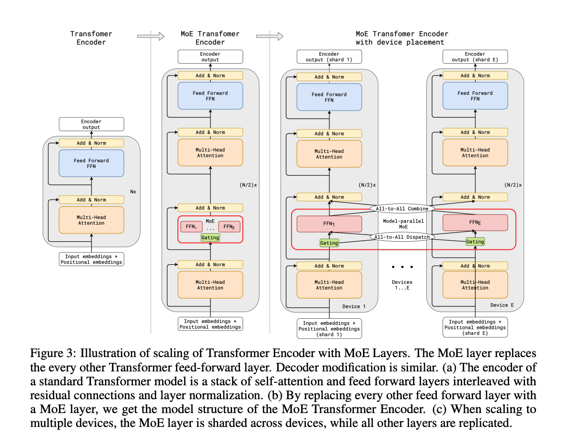

# The Sparsely-Gated Mixture-Of-Experts Layer.

Mixture of Experts 를 정리하는 첫 번째 글이다. 첫 번째 글을 꽤 고민했는데, Transformer 이전 논문 중 가장 의미있다고 생각되는 논문이다.

개인적으로, Transformer 이전과 이후의 MOE 모델은 결과는 다르더라도, 방향성과 인사이트는 상당히 다르다. Transformer 이전  MOE 논문들은 "성능" 개선을 훨씬 강조하는 반면 Transformer 이후 논문들은 모델의 "효율" 개선을 중점에 두고 있다. Transformer 이후의 MOE 는 이후의 글에서 정리하고, 이 글에서는 "성능" 위주 MOE 논문을 하나 정리해두고 지나가려 한다.

## Novelty

딥 모델 내 일부분의 mixture of experts 를 사용하는 것을 제안하는 논문. 실질적인 gating network 의 활용과, multiple gate of networks 의 개념을 도입. 본 논문 이전의 MOE 는 대부분 과제에 따라 Experts Model 전체를 학습시키는 방식이었다. 

단순히 방식의 적용뿐만 아니라, 해당 방식의 잠재력을 정확히 파악한 논문.

두 번째로 해당 논문은 딥 러닝 MOE 모델 학습에 필연적으로 따라오는 두 가지 중요한 문제점을 지적하고, 이를 loss function 을 활용한 

## Structure

구조는 매우 단순하다. 보다 일반적으로 설명하려한다.

기존의 MOE 모델들이 모델 자체를 expert 로 학습한 것과 다르게, 본 논문은 모델 구조 중 일부를 expert 로 학습한다. expert 구조 이전에는 input 이 어떤 expert 를 사용할지 결정하는 gating network 함수를 추가합니다. 전체 모델이 반복해서 사용하는 모듈의 일부를 MOE 구조로 변경한다. 모듈을 반복적으로 사용하는 모델은 1) gating network 로 인한 expert 선택의 다양성, 2) 각 모듈의 expert 선택 조합에 의한 다양성, 두 가지 다양성에 의해 매우 많은 경우의 수를 대응할 수 있게 된다.

해당 논문은 17년도 논문인 만큼, LSTM 을 사용합니다. 이로 인해 각 cell 은 거의 전체가 'Expert' 로 활용된다. 모델 구조의 극히 일부 - FFN - 이 expert 로 분기되는 것은 이보다 몇 넌은 뒤의 연구...

LSTM 의 cell 이 expert 가 되므로 해석은 단순해진다. 각각의 word, 또는 token 이 cell 에 입력이 될때마다 gating network 를 통과하고 이에 따른 expert cell network 를 통과한다. 다음 timestep 은 해당 결과와 현재 token 을 받아 같은 과정을 반복한다. 핵심은, **각각의 token 또는 time 에 따라 expert 가 정해진다는 점**이다.

## Gating Networks

MOE 방식에서는 선택과 집중이 중요합니다. MOE 방식을 선택한 이유도, 기대하는 결과도 모두 input 에 대응하는, 전문적인 expert 가 학습되기를 바라기 떄문이다. 다른 expert 가 학습에 관여하는 것도, loss 가 다른 expert 로 퍼져나가는 것도 원하는 방향이 아니다.

Gating Networks 를 설명하면 다음과 같습니다. Softmax 함수 결과 top-K 만을 expert 로 사용한다. 

$$
G(x) = \text{Softmax}(\text{KeepTopK}(H(x), k))
$$

$$
H(x)_i = (x \cdot W_g)_i + \text{StandardNormal}() \cdot \text{Softplus}((x \cdot W_{\text{noise}})_i)
$$

$$
\text{KeepTopK}(v, k)_i =
\begin{cases} 
    v_i, & \text{if } v_i \text{ is in the top } k \text{ elements of } v. \\
    -\infty, & \text{otherwise.}
\end{cases}
$$

## Engineering

해당 논문에서 제안하는 MOE 구현에서의 가장 큰 challenge 는 두 가지이다.

- batch size
  - expert 개수가 늘어날수록 각각의 expert 가 학습에 사용하는 실질적인 데이터의 수가 비례해서 감소한다. 이는 학습 효율 감소로 이어진다
- expert collapsing
  - gating network 가 일부 네트워크만 선택하도록 학습될 수 있다.

본 논문은 두 문제의 해결책을 제시한다. 특히 expert collapsing 의 경우 해당 논문에서 제안한 해결책이 있다. 창의성이 독복이는 해결법이지만, 최근에 와서는 전제에 맞지 않는 해결법이 되었다. 예를 들어, 현대 deep learning 모델은 descrete 지표를 loss 에 쉽게 반영한다.

# Ref

1. https://arxiv.org/pdf/1701.06538
