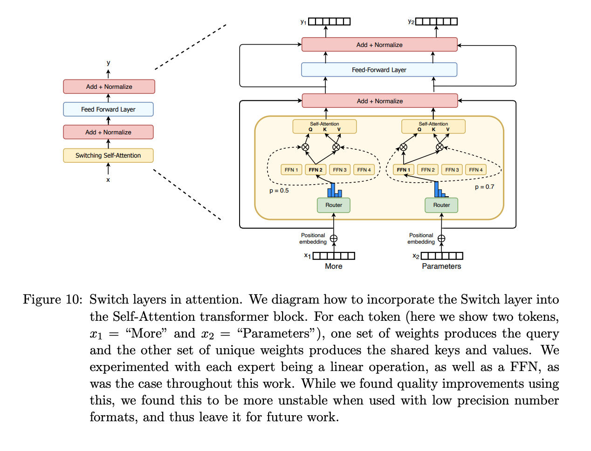
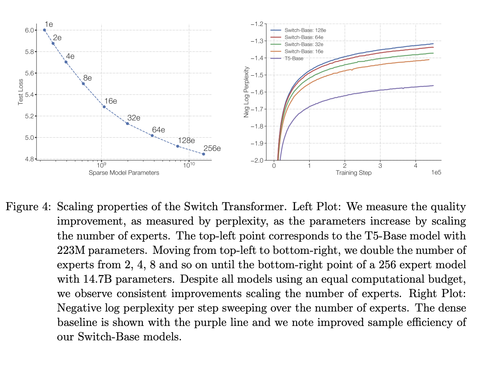

# Adaptive Attention Span in Transformer

Transformer 계열 모델의 구조는 사실상 Mixture of Experts 를 내포하고 있습니다. MHA 모듈의 각 head 는 concat 된 뒤 linear layer 를 거치면서 서로 다르게 활성화됩니다. 엄밀하게 MOE와 정확히 같지는 않고, 보다 복잡하고 세세하게 구성된 MOE 라고 볼 수 있습니다. 사실 Transformer 내부에는 다양한 "전문가" 를 만들어내려는 철학이 많이 녹아있어요. 

다음 글도 도움이 됩니다. [MHA INITIALIZATION](/docs/models/aimodel/Transformer/mha_initialization.md)

Transformer 계열에서 MOE 를 적용하는 것을 이해하기 위해서는 먼저, 각각의 Layer 와 Attention 모듈이 어떻게 동작하는지 이해하는 것이 중요합니다. Transformer-MOE 연구 초기는 MOE 구조를 Transformer 내부로 이동시키는 것에 집중했다면, 후기 연구들은 **Attention 모듈의 특성을 MOE 구조에 보다 엄밀하게 반영**하려고 노력합니다

본 논문은 Attention Module 의 동작을 분석했는데 MOE 논문을 읽으며 동작을 이해하는 데 많은 도움이 됩니다.

## Adaptive Attention Span

 Attention Head 는 각 토큰을 다른 토큰과 얼마나 연관지을지 결정합니다. 본 논문의 첫 관찰은, 각 Attention Head 가 참조하는 토큰의 범위가 크게 차이가 난다는 것입니다. 

 

위 그림은 두 개의 attention head 에서 거리에 따른 attention 크기를 plot한 그래프입니다. Head B 는 Head A 에 비해 훨씬 먼 거리의 token 까지도 attention 값이 크게 유지되는 것을 확인할 수 있습니다. Head A 는 보다 가까운 단어들을 활용해서 문맥을 해석하고, Head B 는 보다 먼 단어들까지 활용해서 문맥을 해석합니다. 

Attention 모듈의 구조 상, Head A 는 가까운 단어들에 집중을 하지만 여전히 먼 단어들까지 고려된 forward 그리고 backward-propagating 이 이루어집니다. 저자들은 이 부분에서 발생하는 비효율에 집중해서 Attention Module 에서 참조하는 크기를 제한합니다. Attention Window 를 attention head 마다 다르게 적용하는 개념이라고 이해할 수 있습니다.

저자들은 아래와 같은 Span Filter 를 적용합니다. $z$ 는 attention head 마다 설정되는 parameter 이며 $R$ 은 일괄적으로 적용되는 smoothing parameter 입니다. 

 예를 들어서, 100번째 토큰을 처리할 때 $100-z$ ~ $100+z$ 까지의 attention 은 그대로 유지되어 활성화됩니다. $100+z$ ~ $100+z+R$ 와 $100-z-R$ ~ $100-z$ 범위의 attention 역시 filter 값을 곱한 크기만큼 활성화됩니다. 그 외 범위의 attention 은 masking 되어 계산에 사용되지 않습니다.

참고로, 구현에 관심있으신 분들은 masking 을 하는 것은 연산 효율에는 도움이 안 된다고 생각하실 것 같습니다. 저자들의 원 코드를 찾아보니, masking 되어야 하는 부분들을 실제로 tensor 에서 제외하고 처리합니다. 결과적으로 실제로 연산량을 줄이도록 만들었습니다.

## Dynamic Adaptive Attention Span

이전 실험에서는 adaptive attention span 크기, $z$ 값을 사람이 직접 설정했습니다. dynamic adaptive attention span 실험에서는 $z$ 값을 학습할 있도록 linear layer 를 사용합니다. 

$$
z_t = S \sigma ( v^T x_t + b )
$$

## Result

본 논문의 실험 결과는 attention module 의 특징 분석, 그리고 효율 개선 두 가지로 나뉘어집니다.

### Attention 분석

저자들은 하위 5개 Layer 에서는 attention span 의 크기가 매우 작다고 말합니다. 즉 하위 layer 에서는 굳이 full-attention 을 활용할 필요가 없다는 점을 시사합니다.

반면 상위 layer 의 일부 어테션 헤드에서는 매우 큰, 몇 천 크기의 attnetion span 이 확인되었다고 이야기합니다.

이는 CNN 의 설계에서 의도한 결과와 동일합니다. 두 방식 모두 초기에는 가까운 feature 위주로 분석하고, 후반에는 전체적인 의미를 해석하도록 동작합니다. 

참고로 Decoder-Only 모델에서는 재밌는 결과가 관찰됩니다. Decoder-only 모델은 input text, output text 에 가장 가까운 초기 그리고 마지막 layer 에서 문법적인 해석에 집중하는 모습을 보여줍니다. 문법은 보다 전체적인 문장 구조를 이해해야하는 과제인데, 이는 encoder 구조와 decoder-only 구조가 그 동작의 유사성과 별개로 과정은 완전히 다를 수 있다는 점을 보여줍니다. 

### 효율 개선

본 논문에서는 Adaptive Attention Span 적용이 모델의 효율성 뿐 아니라, 모델의 성능 개선 역시 달성했다고 서술합니다.

비교를 위해 baseline 모델: Fixed span - 의 attention width 역시 $S$ 로 제한합니다. attention window 를 상정하면 될 것 같습니다.

가장 왼쪽 그래프는 Adaptive Span 을 적용한 모델과 Fixed Span 모델의 BPC 성능을 보여줍니다. 낮은 span 크기에서는 모델의 성능이 비슷이 비슷한데 1000이 넘어가는 범위의 span 크기에서는 adaptive span 모델의 성능이 더 좋아집니다. 하지만 이 결과는 실제로는 모델 성능이 아니라 모델 효용의 문제라고 저는 해석합니다. 큰 모델을 학습하기 위해서는 충분히 많은 데이터와 컴퓨팅 리소스가 필요합니다. 해당 논문에서 사용할 수 있는 데이터와 컴퓨팅 리소스의 크기가 충분하지 않았으며, 만약 충분했다면 Fixed span 의 성능이 더 좋았을 것입니다. 

**사실상 adaptive span 모델은 fixed span 모델의 parameter 가 조정되어 학습될 수 있는 구조이므로 당연합니다.**

이는 SOTA 레벨에서 모델의 성능과 모델의 효용이 사실상 같은 의미임을 나타냅니다.

중간, 오른쪽 그래프는 모델의 효용을 보다 직접적으로 나타냅니다. adaptive span 의 크기가 fixed span 의 크기보다 매우 적으며 이로 인해 FLOPS 가 크게 감소한다고 이야기 합니다.

## Limits

adaptive span 방식은 consecutive span 밖에 설정하지 못한다는 단점을 가지고 있습니다.

또한 Transformer 구조에서 FLOPS 의 또 다른 큰 축인 FFN 는 효율화되지 않았습니다.

## Reference

[1] Adaptive Attention Span in Transforer, https://arxiv.org/pdf/1905.07799