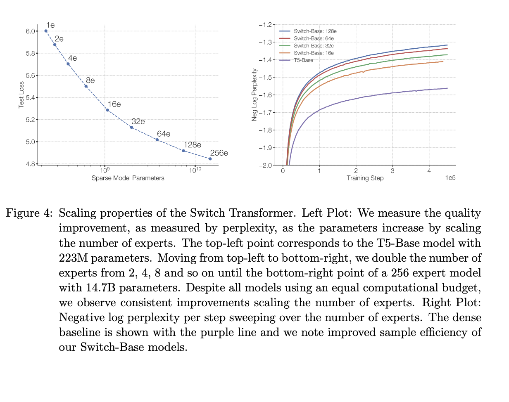
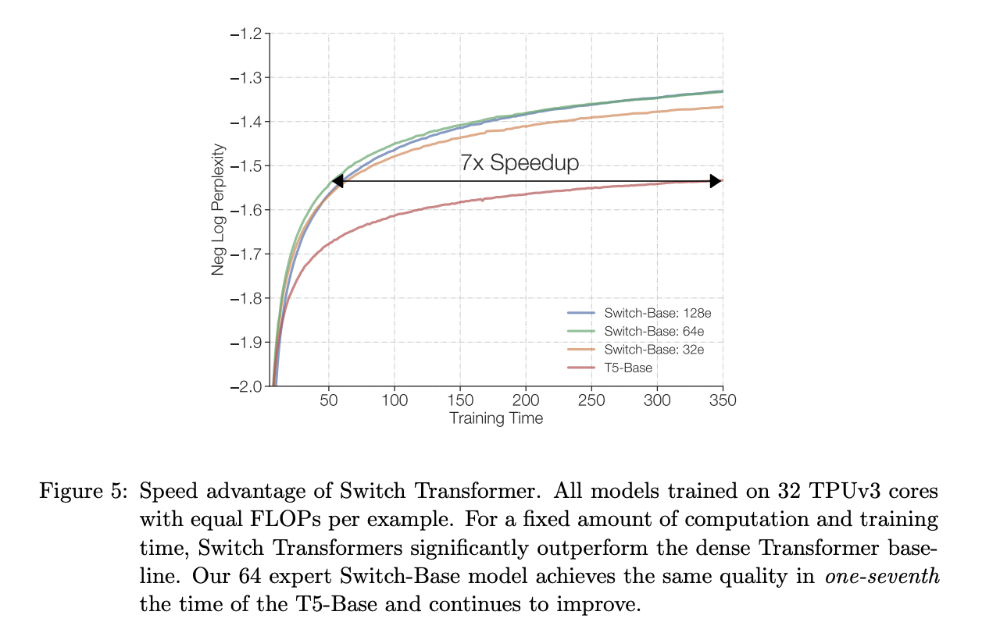

# Switch Transformer

## Introduction

Transformer 계열 논문에 MOE를 적용한 두 번째 대표적인 논문. GShard 이후로도 Transformer 관련 연구의 주류는 MOE 를 이용한 모델의 확장보다는 dense 모델의 확장, 응용이었습니다. Switch Transformer 논문은 이러한 점을 지적하며, sparse model: 모델의 모든 parameter 가 한 토큰의 추론에 필요하지 않은 방식 - 의 효용을 강조합니다.

SwitchTransforemer 논문은 **MOE 구조의 적용과 분석을 구체적으로 pre-training, fine-tuning 그리고 multi-task learning 으로 나누어 진행**합니다. 현대 LLM-MOE 구조 분석에서 pre-train, fine-tuning 그리고 instruction-tuning 을 나누어 분석하는 것을 생각했을 때 큰 의미가 있는 논문이라고 생각됩니다. 

또한 **Sparse Model 을 Dense Model로 성공적으로 distillation**하며, 효율적인 distillation 방안을 제시합니다. 

위 두가지는 사실상 현대 sparse-LLM 개발에서 가장 중요하게 확인하는 두 가지 작업입니다.

마지막으로, Switch Transformer 는 Transformer 에서 전통적으로 적용되던 FFN Expert Layer 를 사용하지 않고, **Attention Expert Layer 를 실험**해보기도 합니다. 이에 대한 결과는 후술하겠습니다.

## Model 구조

Switch Transformer 의 개념적인 구조는 GShard 논문과 동일합니다. 그러나 Switch Transformer 논문은 GShard와 크게 3가지: 1) Attention Layer Expert 실험, 2) Single Expert 적용, 3) Load Balancing 을 위한 Loss 구조 개선 - 점에서 차별화됩니다. 

### Attention Layer Expert

일반적으로 Transformer MOE 구조들은 FFN Layer에 MOE 를 적용하는 것을 기본으로 합니다. Switch Transformer 저자들은 Self-Attention Layer에 MOE를 적용하는 모델 구조를 테스트합니다. 논문에서는 $W_{Q, K, V}$에 MOE 구조를 사용해봅니다. 실험 결과 모델의 성능은 개선되었으나, $fp16$ 사용 시 모델의 학습이 불안정하여 최종 결과에서는 제외했다고 합니다.

### Single Expert

[The Sparsely-gated mixture-of-experts layer](https://arxiv.org/pdf/1701.06538)[1] 논문에서는 MOE 구조 학습을 위해서는 최소 2개의 experts 가 필수라고 주장합니다. 하위 layer 에서는 큰 k 값이 필요하고, 상위 layer 에서는 작은 k 값이 필요하다는 연구도 존재합니다.

Switch Transformer는 top-1 expert를 사용합니다. 저자들은 이 방식이 모델의 성능을 거의 유지하면서, 모델의 전체적인 계산량을 크게 감소시킨다고 합니다. top-1 forwarding 을 사용하는 MOE layer 를 Switch Layer 라 합니다. 

### Differentiable Load Balancing

Switch Transformer 논문도 expert capacity 개념을 사용합니다. 그 외에도, [gshard](/docs/practice/efficienttrain/MOE/gshard.md)와 같이 load balancing loss 역시 활용합니다. 

GShard 논문의 load balancing loss 는 샘플 그룹 단위로, gating layer 의 output 을 이용한 gating 기댓값을 사용합니다. 

Switch Transformer 에서는 expert 가 처리한 token 수와 expert 로 처리될 확률을 곱해서 differentiable loss 를 구현합니다.

## Result

먼저 Switch Transformer는 모델이 충분히 학습되지 않는 것을 막기 위해 대규모 데이터를 활용합니다.

### Scaling Result

1. 모델의 크기가 같아도 expert 를 늘리면 학습이 더 잘된다. (꺼의 consistent 한 결과)

2. 대응하는 크기의 dense model 에 비해 최대 7배의 속도 개선을 확인할 수 있다.

참고로 대응하는 크기의 dense model 은 Switch Transformer, 실질적인 parameter 수를 이용해 비교하는 수식을 논문에서 소개하고있습니다.

### Fine-tuning

이렇게 학습한 모델을 다양한 fine-tuning 해본 결과 Switch Transformer 는 대부분의 task에서 dense 모델보다 좋은 성능을 보였습니다.

### Distillation

1. 먼저 dense model 의 non-expert weight 를 MOE 모델 weight 로 initialization 하는 것은 약간의 개선 효과를 보여준다고 합니다.

2. 75% 의 GT 라벨과 25% 의 teacher model (MOE model) 라벨을 사용하는 것이 모델 성능에 도움이 되었다.

3. distillation 을 통해 82% 모델 압축하면서, 37% 의 quality gain 을 얻을 수 있었다.

3-1. quality gain 은 distillation 이전 teach - student 차이에 비해 distillation 이후 좁혀진 차이를 의미한다.

4. 99% 모델을 압축하더라도 28% 의 quality gain 을 얻을 수 있었다.

# Ref
1. [The Sparsely-gated mixture-of-experts layer](https://arxiv.org/pdf/1701.06538)
2. [Switch Transformer](https://arxiv.org/pdf/2101.03961)