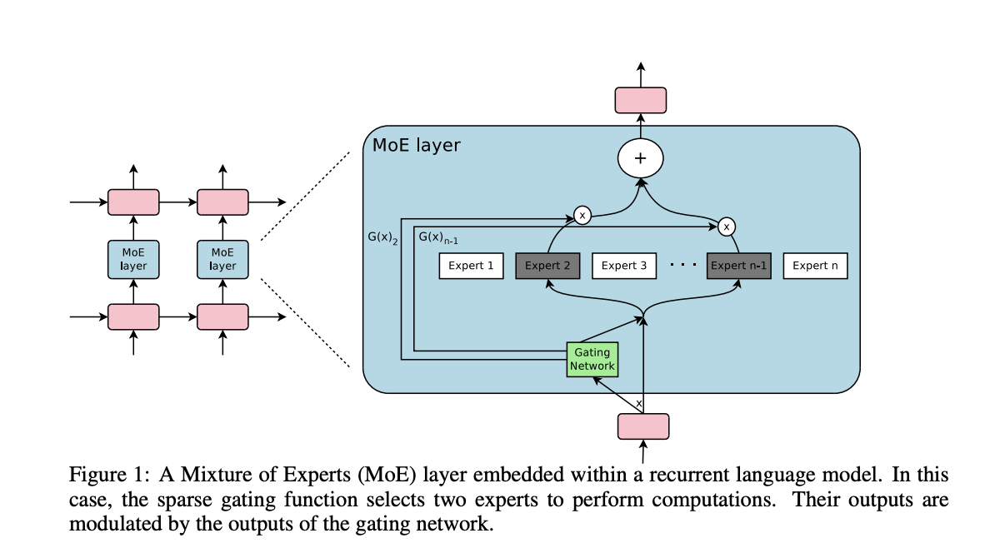

# The Sparsely-Gated Mixture-Of-Experts Layer.

Mixture of Experts 를 정리하는 첫 번째 글이다. 첫 번째 글을 꽤 고민했는데, Transformer 이전 논문 중 가장 의미있다고 생각되는 논문이다.

개인적으로, Transformer 이전과 이후의 MOE 모델은 결과는 다르더라도, 방향성과 인사이트는 상당히 다르다. Transformer 이전  MOE 논문들은 "성능" 개선을 훨씬 강조하는 반면 Transformer 이후 논문들은 모델의 "효율" 개선을 중점에 두고 있다. Transformer 이후의 MOE 는 이후의 글에서 정리하고, 이 글에서는 "성능" 위주 MOE 논문을 하나 정리해두고 지나가려 한다.

## Novelty

딥 모델 내 일부분의 mixture of experts 를 사용하는 것을 제안하는 논문. 실질적인 gating network 의 활용과, multiple gate of networks 의 개념을 도입. 본 논문 이전의 MOE 는 대부분 과제에 따라 Experts Model 전체를 학습시키는 방식이었다. 

단순히 방식의 적용뿐만 아니라, 해당 방식의 잠재력을 정확히 파악한 논문.

## Structure

구조는 매우 단순하다. 보다 일반적으로 설명하려한다.

기존의 MOE 모델들이 모델 자체를 expert 로 학습한 것과 다르게, 본 논문은 모델 구조 중 일부를 expert 로 학습한다. expert 구조 이전에는 input 이 어떤 expert 를 사용할지 결정하는 gating network 함수를 추가합니다. 전체 모델이 반복해서 사용하는 모듈의 일부를 MOE 구조로 변경합니다. 모듈을 반복적으로 사용하는 모델은 1) gating network 로 인한 expert 선택의 다양성, 2) 각 모듈의 expert 선택 조합에 의한 다양성, 두 가지 다양성에 의해 매우 많은 경우의 수를 대응할 수 있게 됩니다.

해당 논문은 17년도 논문인 만큼, LSTM 을 사용합니다. 이로 인해 각 cell 은 거의 전체가 'Expert' 로 활용됩니다. 모델 구조의 극히 일부 - FFN - 이 expert 로 분기되는 것은 이보다 몇 넌은 뒤의 연구입니다.

## Gating Networks

# Ref

