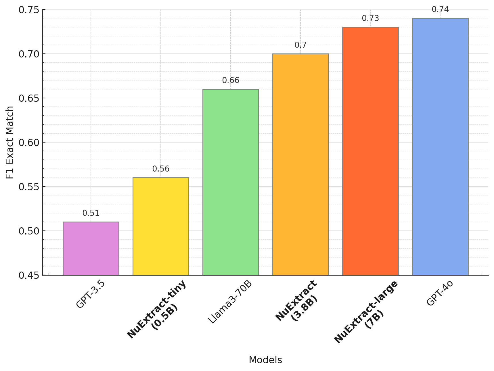
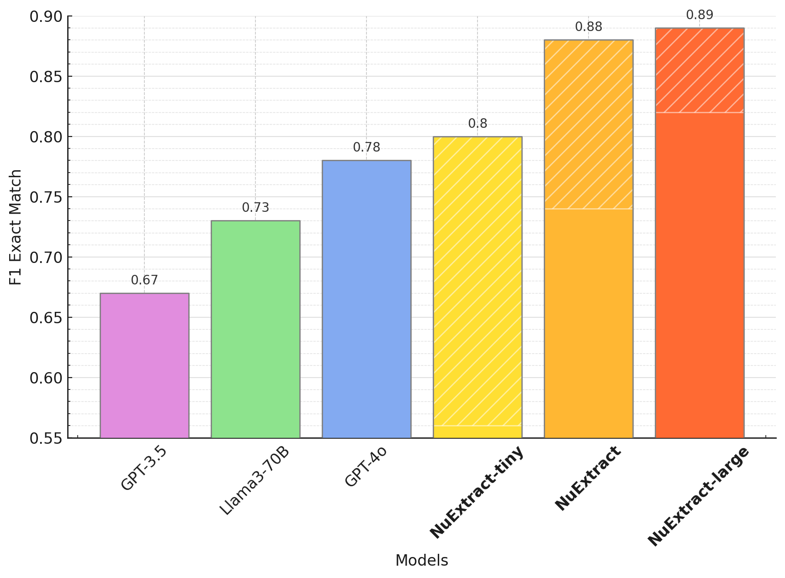

import nuextract from './asset/nuextract.png';


Information Extraction Task 의 어려움 중 하나는 추출해야 하는 정보를 정의하는 일입니다.

UniversalNER 을 포함한 LLM 등장 이전의 연구들의 방향은 이러한 어려움을 '일반적으로 적용가능한 entity type 체계' 를 사용해서 해결해왔습니다.

GPT-3 의 등장 이후로는 LLM 이 학습한 데이터에 이미 충분한 entity type 정보가 녹아 있을 것이라는 가정하에 prompt 를 개선하며 entity type 체계를 정의하지 않는 방식이 선호되어 왔습니다.

NuExtract 는 entity type 체계를 정의해주면 LLM 이 더욱 정확하게 데이터를 추출하며, 특히 **원문 텍스트에 있는 데이터** 추출 정확도가 올라간다고 주장합니다. 그렇다면, 문제는 entity type 체계를 어떻게 정의해주냐 일텐데 논문에서는 template 생성을 LLM 을 통해 진행합니다. 

# NuExtract

Numind 에서 제안하고 발표한 llm 을 활용한 information extraction 의 framework 입니다. 모델이 아니고 framework 라고 설명한 이유는 데이터의 수집, 프롬프트 작성 그리고 모델 학습까지의 전 과정을 포함하고 있기 떄문입니다.

NuExtract Framework 핵심은 크게 두 가지 입니다.

- Template 을 활용해 원하는 양식에 맞는 information extraction output 을 생성할 수 있습니다.
- large-LLM 을 활용해 데이터를 구축하고, small-LLM 에 학습에 사용한다.

아래 그림은 NuExtract 프레임워크 전체 과정을 정리하고 있습니다. 

<div style={{textAlign: 'Center'}}>
    
</div>

먼저 Llama3 와 같은 Large-LLM 을 활용해 Information Extraction 과제의 input-output 을 생성합니다. 이 과정은 zero-shot 으로 수행합니다. NuExtract 의 특이점은 위에서 언급했듯 output 의 template 을 제공한다는 점입니다. 블로그에서 NuExtract 에서 사용한 prompt와, prompt 를 사용해 생성한 데이터의 예시를 전부 확인할 수 있습니다. 

## 컨셉 이해

먼저 inference 과정은 아래와 같은 propmt 를 사용한다고 이해하면 될 것 같습니다. input text 와 함께 infromation extraction 의 entity template 을 제공합니다. 모델은 template 에 맞춰서 input text 로 부터 entity value 를 추출합니다.

```
Given the following JSON template and text, return a version of the JSON template filled in with the relevant data. Don't return anything besides the filled in JSON content.

{
  "reactants" : [{”name” : “” , “quantity” : “”}],
  "reagents" : [{”name” : ””, “quantity” : ””}],
  "solvents" : [{”name” : ””, “quantity” : ””}],
  "catalysts" : [{”name” : ””, “quantity” : ””}],
  "time" : [“”],
  "temperature" : [“”]
}

Input: *<input>*

Output:
```

논문에서는 **ICL 을 활용하는 편이 단순히 template 을 제공하거나 각 field 에 대한 description 을 추가하는 것보다 더 성능이 좋다**고 이야기합니다. 예시에 훨씬 많은 정보가 녹아있다고 이야기합니다. 또한 **ICL 보다는 fine-tuning이 더 성능이 좋다**고 이야기합니다.
먼저 prompt 의 예시입니다.

## Framework

**NuExtract 의 학습 데이터 구성을 위한 데이터 구축 방법**입니다. 기본적으로 C4 데이터셑에 포함된 english document 들을 데이터로 활용합니다.

먼저 **LLM 을 사용해 각 데이터로부터 template(schema) 를 추출**합니다. 논문에서는 baseline LLM 으로 Llama3 를 사용합니다. 이 과정에서는 value 는 추출하지 않습니다. 

```
!!!START Context!!!

*<text-to-annotate>*

!!!END Context!!!

Goal: Generate an information extraction dataset.

Input: Text document + instructions for annotation.

Output: 1 JSON object (schema).

Schema:
Describes the information to be extracted.
Each field should:
Be a clear and concise name representing the extracted data.
ONLY STRING TYPE ARE ALLOWED AS VALUES (it can be an array of strings, or an object with string values, or an array of objects with string values...).
NO BOOLEAN, INT, ENUM, ETC.
The schema can focus only on part of the context document, or on the whole document.

Constraints:
Extracted information should be thematically coherent and form a well-structured JSON schema with a clear relationship between fields.

*<few-shot examples>*
```

다음으로 역시 LLM 을 활용해 생성한 template 을 활용해 entity value 를 추출합니다. 이 과정에서 input document text 를 변형합니다. 절반은 full-text  를 그대로 사용하고 나머지 절반은 텍스트의 일부를 삭제합니다. (template 은 유지합니다.)

template 이 input document 를 활용해서 생성되었기에 사실상 negative entity type : 아무런 value 가 없는 entity type - 이 있을 수 없습니다. 그래서 **텍스트를 전부 사용해서 데이터를 생성하면 모델은 사실상 negative entity 를 학습할 수 없습니다**. non-negative dataset 을 통해 학습한 LLM 은 당연히 template 을 전부 채우는 방향으로 hallucination 이 심한 output 을 생성하게 될 것입니다. 그래서 저자들은 텍스트의 일부를 삭제하는 것을 hallucination 문제 해결을 위한 **negative sampling 의 일종**이라고 설명합니다. 


```
!!!START Context!!!

*<text-to-annotate>*

!!!END Context!!!

Goal: Extract strings from the text corresponding to the given schema.

Input: Text document + schema.

Output: 1 JSON object

Schema:
The schema describes the information to be extracted.
ONLY STRING TYPE ARE ALLOWED AS VALUES (it can be an array of strings, or an object with string values, or an array of objects with string values...).
NO BOOLEAN, INT, ENUM, ETC.
The schema can focus only on part of the context document, or on the whole document.

Output:
THE OUTPUT SHOULD FOLLOW EXACTLY THE SCHEMA.
It should respect the schema and contain the extracted information from the context document.
THE STRING SHOULD BE PRESENT EXACTLY AS IT IS IN THE CONTEXT DOCUMENT. NO PARAPHRASING ALLOWED.
If the information is NOT PRESENT in the context, return "" for empty string and [] for empty array. If the list of object is empty, return [].
Return only the information extracted as JSON. Do not output anything else or says anything else.

Information to extract:

*<schema>*
```

논문에서는 이렇게 생성된 데이터셑의 장점이자 단점으로 output이 **copy-pasting 구조, 즉 원문 텍스트에서 유래**됨을 강조합니다. 모델의 이러한 특성은 negative sampling 에서 유래되었다고 합니다.

300k pair 에서 최종적으로 50k 개의 데이터 페어를 생성하여 학습에 사용합니다. 

## Train

이렇게 생성한 대형 데이터셑을 통해 NuExtract Framework 를 학습시킵니다. 그 후 평가한 결과 NuExtract 는 일반적인 과제에서 꽤 높은 수준의 bench mark score 를 보여주고 있습니다. 



## Finetune

NuExtract 의 시사점 중 하나는 finetuning 으로 인해 작은 모델의 성능이 크게 오른다는 점입니다. 특히, 매우 넓은 도메인의 전문 지식이 필요하지 않은 specific taks 의 경우 LLM 을 활용하는 것이 매우 부담스럽습니다. NuExtract 의 Finetuning task 는 작은 모델로도 충분히 특정 도메인에서 LLM 의 범용성과 함께 domain specific knowledge 를 전부 사용하는 모델을 학습시킬 수 있다는 점을 시삽합니다.



전반적으로 약 10% 의 성능 향상이 있지만, tiny-model 의 성능 향상이 눈에 두드리집니다. 모델 사이즈에 따른 finetuning 효과를 그래프로 그리면 어느 순간 saturation 이 발생할 것으로 보입니다. 그림같은 경우 "화학" 분야에 대한 finetuning 결과 입니다. 아마도 꽤 넓은 범위더라도 finetuning 활용은 모델의 성능에 큰 영향을 미치며, 이는 특히 **넓은 범위에서 디테일한 정보를 기억할 능력은 부족한 tiny 모델에서 두드러지는 것**으로 보입니다.

이를 달리 표현하면, 작은 모델이라도 특정 domain 에 대해서는 finetuning 등을 통해 충분히 large model 과 비슷한 수준의 성능을 보여줄 수 있다는 사실입니다.


# Ref

1.[NuExtract Blog](https://numind.ai/blog/nuextract-a-foundation-model-for-structured-extraction)

2. [NuNER Paper](https://arxiv.org/pdf/2402.15343)